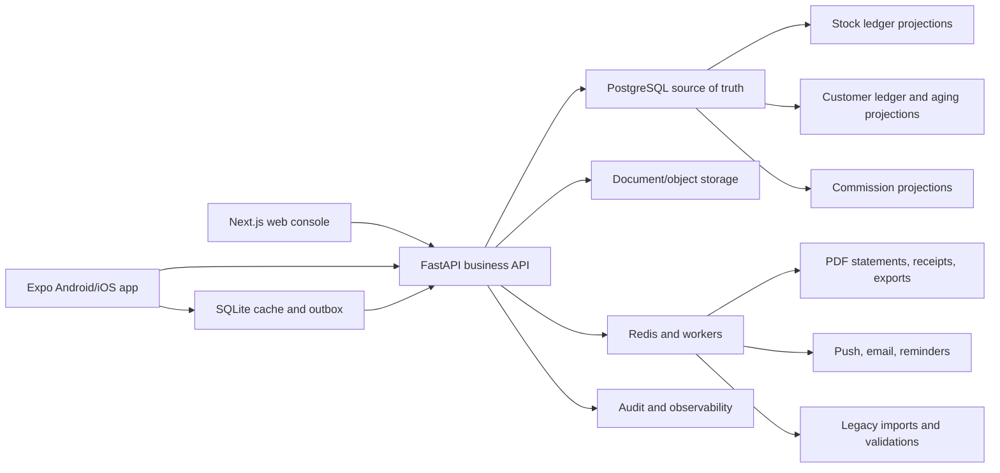

# TradeFlow ERP system architecture

## Architecture principles

1. One shared business API protects rules for web, Android, and iOS.
2. Financial and stock balances are projections from immutable movements.
3. Sales order, delivery, invoice, and payment are separate lifecycles.
4. Cross-context side effects use an outbox and idempotent handlers.
5. Start as a modular monolith plus workers; split only for measured reasons.
6. Mobile focuses on field workflows rather than mirroring the entire web ERP.

## Topology

## Modular backend boundaries

- `identity_and_access`
- `customers`
- `catalog_and_inventory`
- `sales`
- `fulfillment`
- `returns`
- `procurement`
- `finance`
- `commissions`
- `documents_and_notifications`
- `reporting_and_exports`
- `migration_and_audit`

Each module owns its domain services and tables. Cross-module reads use explicit
query services; cross-module reactions use committed outbox events where
transactional coupling would otherwise become unsafe.

## Critical transactional flows

### Sales to receivables

1. Commercially approved sales order requests reservations.
2. Inventory reserves eligible stock without changing on-hand quantity.
3. Prepaid demand requires sufficient cleared customer prepayment before pick
   release; backorder demand is not collected prematurely.
4. Fulfillment posts outbound stock movements for confirmed delivery.
5. Delivery confirmation creates one draft invoice idempotently for the
   accepted quantities in that delivery.
6. Finance approves and posts the invoice.
7. Payment receipt records incoming funds.
8. Payment allocations reduce specific invoice balances; related prepayment is
   allocated after its delivery invoice posts.
9. Customer statement projection refreshes from committed ledger entries.

For Cash on Delivery, server-accepted Delivery Confirmation atomically records
accepted quantity, Proof of Delivery, and sufficient COD Payment Receipt. Cash
collected by an authorized delivery user is cleared immediately but remains
subject to Cash Reconciliation. Other methods follow their configured
verification. Unpaid accepted value requires authorized conversion to On
Account and any applicable Credit Override.

For On Account, Commercial Approval serializes the Customer Account's Credit
Exposure check. Exposure combines posted Open Balance with approved,
uncancelled order value not yet represented by a posted Invoice. Invoice
posting atomically replaces matching uninvoiced exposure. A Credit Hold blocks
approval, and an absent or exceeded Credit Limit requires an order-specific
Credit Override.

Commercial Approval freezes each line's Pricing Snapshot. Customer-specific
Price Lists precede Branch defaults. Order-wide discounts are allocated to
lines. Excessive discount and below-floor price require maker-checker approval
from another authorized User. Material commercial changes invalidate approval
and rerun pricing, credit, and reservation checks.

On Account and Cash on Delivery reservations persist until fulfillment,
cancellation, an approval-invalidating change, or authorized Reservation
Release. Prepaid reservations carry a Branch-configured Payment Deadline. An
unpaid deadline releases quantity idempotently to Backorder Demand and applies
Payment Hold. Later payment cannot bypass a new reservation.

All quantity, unit-price, rate, tax, discount, and Money Amount calculations use
decimal arithmetic. Posted money uses the currency minor unit and
round-half-up. Order totals sum rounded lines. Largest-remainder allocation with
stable line ordering distributes order-level amounts, and the final partial
delivery receives any residual. Calculation Snapshots retain inputs and rounded
outputs.

### Damaged return

1. Return authorization validates delivered quantity and prior returns.
2. Return receipt posts stock into quarantine/damaged location.
3. Inspection records condition and disposition.
4. Restock requires a separate approved movement into available inventory.
5. Finance posts a credit note or Sales creates replacement fulfillment.
6. Commission module creates reversal/adjustment if the plan requires it.

### Purchase receipt

1. Approved purchase order defines expected quantities and cost.
2. Goods receipt posts stock to receiving or inspection location.
3. Variances and backorders remain explicit.
4. International freight/customs costs are accumulated and allocated by the
   selected landed-cost policy.
5. Supplier return posts a separate outbound movement.

## Financial model

Never store a customer’s paid/unpaid balance as a manually editable field.
Invoices, payment allocations, credits, and adjustments produce immutable
customer ledger entries. Open balance and statement views are transactionally
refreshed projections that can be rebuilt and reconciled.

“Real time” means the updated balance is visible after the posting transaction
commits. Draft or unapproved documents do not affect posted balances.

The Company has one immutable Base Currency. Sales and customer receivables use
it in the first release. International Procurement may use one foreign
Transaction Currency per document; postings retain an approved Exchange Rate
Snapshot, inventory value remains in Base Currency, and later settlement
differences create explicit foreign-exchange adjustments.

Authorized cash collection clears immediately and is later reconciled.
Bank-transfer, check, and manually recorded electronic Payment Receipts begin
Pending Verification. A different eligible Finance User verifies clearance;
active External Payment References are unique per Company and Payment Method.
Provider-confirmed electronic payments can clear through the same contract.
Rejection and reversal preserve immutable receipt history.

## Inventory model

Every quantity change has a movement, source document, warehouse/location,
posting time, actor, and reversal relationship where applicable. Reservations
affect availability, not on-hand quantity. Corrections use reversing and
replacement movements rather than editing history.

Picking transfers quantity from Available to Dispatch Staging, where it remains
warehouse on-hand but unavailable. Dispatch moves it to In Transit custody
outside warehouse on-hand. Delivery Confirmation partitions dispatched
quantity exactly: accepted stock posts outbound; refused or damaged stock
remains In Transit until Return-to-Warehouse Receipt moves it to Quarantine;
short or missing stock moves to Investigation until an approved recovery,
claim, or Inventory Adjustment.

The same server-accepted Delivery Confirmation issues one immutable Delivery
Receipt for accepted quantity. A Branch-specific Document Series assigns a
unique, never-reused number and audits voided or skipped numbers. Proof of
Delivery remains linked evidence. Idempotent retries reuse document identity,
and corrections create linked reversal and replacement records and movements.
A Delivery Correction replays the complete outcome partition under
maker-checker control, reverses and replaces stock at the original outbound
unit cost, replaces only an unposted Draft Invoice source, and issues a newly
numbered receipt when corrected accepted quantity remains. It never edits the
original Confirmation, evidence, receipt, number, movement, or invoice source.
The fulfillment module currently posts correction stock effects and updates
`inventory_availability`/`inventory_valuation` projections inside the same
transaction; this is a deliberate short-term coupling while the slice
stabilizes, and will move into a shared inventory-projection service so
opening-stock, delivery, and correction posting share one canonical
implementation.

Reservations commit quantity without prematurely assigning lot or serial
identity. Picking assigns required identities. Expiration-controlled stock uses
FEFO by default, prohibits expired outbound posting, and requires an authorized
reason to choose another eligible lot.

Inventory value uses a perpetual moving weighted average per SKU and Warehouse
in the Company Base Currency. Each outbound movement snapshots its unit cost.
Transfers carry source cost into the destination average, customer returns use
their original delivery cost, and corrections use immutable value adjustments
or reversals.

## Mobile sync

The initial release supports cached authorized reference data, offline Sales
Order drafts, and offline Proof of Delivery evidence. A local SQLite
transaction records the draft, client-generated identity, and idempotent outbox
command. The UI presents this work as Pending Sync and resumes interrupted
evidence uploads.

Commercial Approval, Inventory Reservation, Pick or Dispatch posting, Delivery
Confirmation, stock movement, and invoice creation require server
acknowledgement. The server validates permissions, document version,
idempotency key, and current workflow state. Posting conflicts are routed for
explicit review rather than auto-merged. Posted financial and stock
transactions remain server-authoritative.

## Security and controls

- capability, branch, warehouse, and approval-limit scopes enforced on every
  command;
- configurable Sales Representative, Sales Manager, Warehouse Clerk, Warehouse
  Supervisor, Delivery Staff, Finance Staff, and Operations Administrator role
  templates;
- administrator status alone grants no business approval authority;
- maker-checker approval for sensitive prices, credits, adjustments, expenses,
  purchase orders, and commission changes;
- signed, expiring document access;
- immutable audit events for posting, reversal, approval, and export;
- PII and financial-data masking by role;
- rate limiting and device/session revocation;
- encrypted secrets and backups.

## Observability

Track command latency, database query time, worker queue age, document
generation failures, import validation errors, stock projection lag, ledger
projection lag, reconciliation differences, mobile outbox age, notification
receipts, and client version distribution. Propagate a correlation ID across
web/mobile, API, workers, postings, and audit.

## Scaling path

Use PostgreSQL read models, indexes, partitions, and reporting replicas before
extracting services. Separate document/report workers and legacy imports first
because they have distinct resource profiles. Extract inventory or finance only
when team ownership, independent scaling, or failure isolation provides
measured value.
