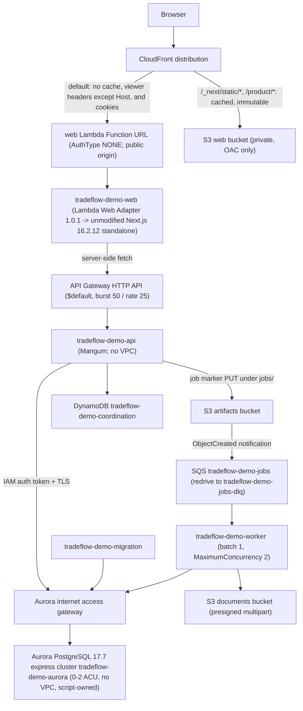

# Serverless demo runbook

Operating guide for the serverless form of the public demo in `ap-southeast-2`
(account `527673188999`). The express-configuration Aurora cluster and the
`ci`, `data`, `app` and `budget` stacks are provisioned; the demo answers on
`dt7yjmo5ppcxs.cloudfront.net`. The existing EC2 host (`i-0dbb59b359b95f12c`,
Elastic IP `52.64.5.66`) remains running as the rollback target throughout cutover;
see `docs/runbooks/serverless-cutover.md` for the migration itself.

Everything is CloudFormation plus the AWS CLI, except the Aurora cluster:
templates live under `infra/cloudformation/`, and
`infra/scripts/deploy-serverless.sh` deploys the data and app stacks with `aws
cloudformation deploy` while `infra/scripts/provision-aurora.sh` owns the
cluster. The `ci` stack is a one-time bootstrap. No additional CLI tooling is
required.

## Architecture



Request path: the browser reaches CloudFront; the default origin is the web
Lambda Function URL (public origin, `AuthType NONE`, caching disabled) and the
web Lambda renders Next.js and calls the API Gateway HTTP API server-side. No
Lambda is in a VPC. The API, worker and migration Lambdas reach Aurora through
the Aurora internet access gateway — express clusters cannot be associated with
a VPC — authenticating with a per-connection IAM token over TLS. There is no
NAT gateway and no interface endpoint because there is nothing for them to
attach to.

## Deployed resource inventory

All names are prefixed with the `ProjectName` parameter, default `tradeflow-demo`.

### Aurora cluster `tradeflow-demo-aurora` (not a stack)

| Attribute | Value |
| --- | --- |
| Engine | Aurora PostgreSQL 17.7, express configuration |
| Endpoint | `tradeflow-demo-aurora.cluster-c9m6sguycrg7.ap-southeast-2.rds.amazonaws.com`, port 5432 |
| Resource id | `cluster-OU3EFK4P5KDUKJPSOJLGDFC4NA` |
| Master user | `tradeflow` (IAM authentication only; no password) |
| Scaling | Serverless v2, `MinCapacity` 0, `MaxCapacity` 2, `SecondsUntilAutoPause` 300 — confirmed set |
| Protection | Deletion protection enabled |
| Owner | `infra/scripts/provision-aurora.sh` (idempotent) |
| Network | No VPC; reachable only through the Aurora internet access gateway |

`provision-aurora.sh` creates the cluster if it is missing; otherwise it waits
for the cluster to leave `modifying`/`backing-up`, re-applies the scale-to-zero
settings, and re-applies deletion protection. CloudFormation cannot create an
express cluster because it does not expose `WithExpressConfiguration`.

Express configuration cannot create an initial database, so `tradeflow_demo`
does not exist at cluster creation. The deployment creates it through the
migration Lambda.

### Stack `tradeflow-demo-data` (`data.yaml`)

| Resource | Name | Notes |
| --- | --- | --- |
| S3 web bucket | `tradeflow-demo-web-<account>-ap-southeast-2` | Private, readable only through CloudFront OAC |
| S3 documents bucket | `tradeflow-demo-documents-<account>-ap-southeast-2` | Evidence uploads, presigned multipart, CORS, incomplete uploads aborted after 7 days |
| S3 artifacts bucket | `tradeflow-demo-artifacts-<account>-ap-southeast-2` | Job markers under `jobs/`, expire after 14 days, no public access |
| DynamoDB table | `tradeflow-demo-coordination` | On-demand, PK `pk`, SK `sk`, TTL attribute `ttl` |
| SQS queue | `tradeflow-demo-jobs` | Visibility timeout 960 s, redrive to `tradeflow-demo-jobs-dlq` after 5 receives; queue policy lets the artifacts bucket publish |
| SQS dead-letter queue | `tradeflow-demo-jobs-dlq` | Holds poison messages; both queues retain messages for 14 days |

### Stack `tradeflow-demo-app` (`app.yaml`)

| Resource | Name | Notes |
| --- | --- | --- |
| API Lambda | `tradeflow-demo-api` | Container image, no VPC, 1024 MB, 60 s, no reserved concurrency |
| Worker Lambda | `tradeflow-demo-worker` | No VPC, 1024 MB, 900 s, SQS event source, batch size 1, `MaximumConcurrency: 2`, `ReportBatchItemFailures` |
| Migration Lambda | `tradeflow-demo-migration` | Same API image, handler `tradeflow_api.migration_handler.handler`, 900 s, no VPC |
| Web Lambda | `tradeflow-demo-web` | Container image with AWS Lambda Web Adapter 1.0.1 running the unmodified Next.js 16.2.12 standalone server, no VPC, 1024 MB, 30 s |
| HTTP API | API Gateway `$default` route | Throttling burst 50 / rate 25, integration timeout 30 s |
| Distribution | CloudFront | S3 origin for `/_next/static/*` and `/product/*`; web Function URL default origin |

The API, worker and migration roles carry `rds-db:connect` on
`arn:aws:rds-db:<region>:<account>:dbuser:cluster-OU3EFK4P5KDUKJPSOJLGDFC4NA/tradeflow`.
CloudWatch log groups `/aws/lambda/tradeflow-demo-{api,worker,migration,web}`
have 7-day retention.

### Stack `tradeflow-demo-ci` (`ci.yaml`)

`tradeflow-demo-deploy`, a GitHub OIDC deploy role temporarily allowing
`repo:Kagerrak@*/tradeflow-erp@*:ref:refs/heads/main` and
`repo:Kagerrak@*/tradeflow-erp@*:ref:refs/heads/feat/serverless-aws-demo` through the pre-existing
`token.actions.githubusercontent.com` provider
(`arn:aws:iam::527673188999:oidc-provider/token.actions.githubusercontent.com`).
Narrow the subject list to main after this branch merges.
Permissions are scoped to CloudFormation, Lambda, ECR, SSM, IAM roles named
`tradeflow-demo-*`, networking, storage, RDS/DynamoDB/SQS, CloudFront/API
Gateway, and CloudWatch Logs. No long-lived AWS keys are stored in GitHub.

### Stack `tradeflow-demo-budget` (`budget.yaml`)

A tag-filtered monthly cost budget for `Project=tradeflow-demo` with an email
subscriber, a $10/month limit, an 80% actual alert and a 100% forecasted alert.
A budget is a notification, not a spending cap: it neither throttles nor stops
anything.

### Stack `tradeflow-demo-network` (`network.yaml`, unused)

The original private-VPC design — two private subnets, free S3 and DynamoDB
gateway endpoints, no NAT gateway and no internet gateway, plus Lambda and
database security groups. It was deployed early for the design that the free
plan rejected and is now unused. It is preserved for the day the account moves
off the free plan; `deploy-serverless.sh` does not deploy it, and nothing in the
running demo depends on it.

## Lambda images

The API and worker images are built on `public.ecr.aws/lambda/python:3.13`; a
plain Python base image fails with `Runtime.InvalidEntrypoint` because the
runtime client is missing. The build copies the uv venv's site-packages into
`/var/lang/lib/python3.13/site-packages` and adds a `.pth` file appending
`/var/task`, because the runtime ignores a custom `PYTHONPATH`. It also runs
`chmod -R a+rX /var/task`, because the runtime is non-root. The web image adds
the AWS Lambda Web Adapter 1.0.1 on the same base.

## Job flow: outbox to SQS

1. The API Lambda commits business state and its `outbox_events` row in one
   PostgreSQL transaction.
2. After a successful mutating `/v1/` request — and on a bounded,
   activity-gated recovery pass at most every 300 s — it writes a small JSON
   marker object to `s3://<artifacts>/jobs/<kind>/<id>.json`.
3. The artifacts bucket notification publishes that object event to
   `tradeflow-demo-jobs`, which triggers the worker Lambda. There is no polling
   loop. The S3 marker is a durable, replayable dispatch record: with the
   Lambdas outside a VPC, publishing straight to SQS would also work, and the
   marker path was kept deliberately for that replayability.
4. The worker runs with batch size 1 and at most 2 concurrent executions.
   There is one job per (outbox event, handler group); groups are `delivery`
   (finance/documents) and `notifications`.
5. Handlers record `outbox_handler_receipts` rows, so redelivery is a no-op.
6. Markers are keyed by event id and group, so re-publishing is an idempotent S3
   overwrite that always re-fires the notification.
7. A message that fails is received up to 5 times and then lands in
   `tradeflow-demo-jobs-dlq`.

The Redis/ARQ worker was deleted.
`apps/worker/src/tradeflow_worker/local_worker.py` is the local-development
equivalent, and `drain_pending_outbox` is used by tests.

## Demo reset lifecycle

There is no timer. Coordination lives in DynamoDB at `pk=demo, sk=state` and
`pk=demo, sk=lock`.

1. The API Lambda middleware reads the coordination record — never PostgreSQL —
   on every `/v1/` request.
2. When `next_reset_at` has passed it marks the state `refreshing` and publishes
   a `demo_reset` job.
3. The worker takes a single-flight DynamoDB lock with a 15-minute expiry
   (recovered automatically if the worker dies) plus a PostgreSQL advisory lock.
4. It truncates, then re-seeds by driving the real API in-process over loopback.
   The seeder `scripts/seed_demo.py` is reused unchanged.
5. It validates the seed contract, then marks the state `ready` with
   `next_reset_at = now + 45 minutes`.
6. While the state is not ready the API returns 503 `demo_refreshing` (or
   `demo_refresh_failed`) for `/v1/`, so nobody can read partially reset data.
7. The console shows a "Preparing the demo" overlay
   (`apps/web/components/demo-preparation-gate.tsx`) that distinguishes
   preparation, readiness, and genuine failure.

Because a reset can follow a long idle gap, the web tier mints a short-lived
HS256 demo token on demand from the shared demo signing secret
(`apps/web/lib/demo-credential.ts`) instead of reading a rotating file; a stored
two-hour token would expire while the cluster is paused. The web Lambda needs no
AWS permissions and no AWS SDK.

## Deploy

Normal path: push to `main`, which runs `.github/workflows/deploy.yml`. The
workflow builds three container images from `apps/*/Dockerfile.lambda` into the
existing ECR repositories (`tradeflow-demo-api`, `-worker`, `-web`), syncs
`.next/static` and `public/` from the built web image to the private S3 bucket,
runs the deploy script, then smoke-tests the CloudFront URL. The old EC2
pipeline is preserved manual-only as `.github/workflows/deploy-ec2-legacy.yml`.

Manual deployment:

```bash
AWS_REGION=ap-southeast-2 IMAGE_TAG=<git-sha> ./infra/scripts/deploy-serverless.sh
```

The script runs eight separate steps so a failure is unambiguous:

1. Ensure the demo secrets exist in SSM Parameter Store (create-only).
2. Provision the Aurora express-configuration cluster (`provision-aurora.sh`).
3. Deploy `tradeflow-demo-data` (S3, DynamoDB, SQS + DLQ).
4. Deploy `tradeflow-demo-app` (Lambdas, HTTP API, CloudFront).
5. Apply runtime configuration to the four Lambda functions from Parameter
   Store, including `TRADEFLOW_DB_IAM_AUTH` / `TRADEFLOW_WORKER_DB_IAM_AUTH`.
6. Create the application database, then run schema migrations: invoke
   `tradeflow-demo-migration` with
   `{"action":"create-database","name":"tradeflow_demo"}`, then
   `{"action":"upgrade","revision":"head"}`. `SKIP_MIGRATIONS=1` skips this step.
7. Queue an initial demo rebuild when the coordination state is empty
   (`SEED_DEMO=0` skips it).
8. Verify the public web and API endpoints.

The `ci` stack is a one-time bootstrap deployed directly, because the deploy
role must exist before GitHub Actions can run the script:

```bash
aws cloudformation deploy --region ap-southeast-2 \
  --stack-name tradeflow-demo-ci \
  --template-file infra/cloudformation/ci.yaml \
  --capabilities CAPABILITY_NAMED_IAM \
  --parameter-overrides \
    OidcProviderArn=arn:aws:iam::527673188999:oidc-provider/token.actions.githubusercontent.com
```

## Verify

Stack health:

```bash
aws cloudformation describe-stacks --region ap-southeast-2 \
  --stack-name tradeflow-demo-app \
  --query 'Stacks[0].StackStatus' --output text
```

Public URL and demo state:

```bash
curl -fsS "https://dt7yjmo5ppcxs.cloudfront.net/api/demo/status"   # {"status":"ready", ...}
curl -fsS "https://dt7yjmo5ppcxs.cloudfront.net/api/health"
```

Schema revision (the deployment verified revision `0024`):

```bash
aws lambda invoke --region ap-southeast-2 \
  --function-name tradeflow-demo-migration \
  --payload '{"action":"current"}' \
  --cli-binary-format raw-in-base64-out /dev/stdout
```

Prove the cluster reaches 0 ACU (this is the whole point of the auto-pause
configuration):

```bash
aws cloudwatch get-metric-statistics --region ap-southeast-2 \
  --namespace AWS/RDS --metric-name ServerlessDatabaseCapacity \
  --dimensions Name=DBClusterIdentifier,Value=tradeflow-demo-aurora \
  --start-time <iso8601-utc> --end-time <iso8601-utc> \
  --period 300 --statistics Average
```

Expect `Average` 0.0 while the demo is idle and a non-zero value for roughly
five minutes after activity, after which `SecondsUntilAutoPause` (300 s) pauses
the cluster again.

Coordination items:

```bash
aws dynamodb get-item --region ap-southeast-2 \
  --table-name tradeflow-demo-coordination \
  --key '{"pk":{"S":"demo"},"sk":{"S":"state"}}'
aws dynamodb get-item --region ap-southeast-2 \
  --table-name tradeflow-demo-coordination \
  --key '{"pk":{"S":"demo"},"sk":{"S":"lock"}}'   # absent when unlocked
```

`state` should read `status=ready` with a `next_reset_at`; `refreshing` is
normal while a rebuild runs, and `failed` should be treated as an incident.

Logs (7-day retention bounds both volume and cost):

```bash
aws logs tail /aws/lambda/tradeflow-demo-api --region ap-southeast-2 --follow
aws logs tail /aws/lambda/tradeflow-demo-worker --region ap-southeast-2 --since 1h
aws logs tail /aws/lambda/tradeflow-demo-web --region ap-southeast-2 --since 1h
```

Queue depth, then redrive the DLQ:

```bash
QUEUE_URL=$(aws cloudformation describe-stacks --region ap-southeast-2 \
  --stack-name tradeflow-demo-data \
  --query "Stacks[0].Outputs[?OutputKey=='JobsQueueUrl'].OutputValue" --output text)
aws sqs get-queue-attributes --region ap-southeast-2 --queue-url "$QUEUE_URL" \
  --attribute-names ApproximateNumberOfMessages ApproximateNumberOfMessagesNotVisible

DLQ_URL=$(aws cloudformation describe-stacks --region ap-southeast-2 \
  --stack-name tradeflow-demo-data \
  --query "Stacks[0].Outputs[?OutputKey=='JobsDeadLetterQueueUrl'].OutputValue" --output text)
DLQ_ARN=$(aws sqs get-queue-attributes --region ap-southeast-2 --queue-url "$DLQ_URL" \
  --attribute-names QueueArn --query 'Attributes.QueueArn' --output text)
QUEUE_ARN=$(aws sqs get-queue-attributes --region ap-southeast-2 --queue-url "$QUEUE_URL" \
  --attribute-names QueueArn --query 'Attributes.QueueArn' --output text)

aws sqs start-message-move-task --region ap-southeast-2 \
  --source-arn "$DLQ_ARN" --destination-arn "$QUEUE_ARN"
aws sqs list-message-move-tasks --region ap-southeast-2 --source-arn "$DLQ_ARN"
```

Redrive is safe because handlers are idempotent: a message that already has an
`outbox_handler_receipts` row is a no-op. A message that keeps failing will
return to the DLQ after another 5 receives.

## Operating limits

| Limit | Value | Consequence |
| --- | --- | --- |
| Lambda concurrency quota | 10 concurrent executions, minimum 10 unreserved | No function can reserve concurrency. The account quota is itself the concurrency bound, alongside API Gateway throttling and the worker's `MaximumConcurrency: 2`. A traffic burst can saturate every function in the account. |
| API Gateway integration timeout | 30 s | The first request against a fully paused cluster can return 504 and succeed on the bounded retry (`packages/api-client/src/retry.ts`: 20 s per attempt, 3 attempts, only GET/HEAD/OPTIONS or requests carrying an `Idempotency-Key`). |
| Aurora resume time | about 15 s; 30 s or more if paused over 24 hours | AWS recommends client connect timeouts above 15 s and retry logic. Base 504s on this, not on application errors. |
| Auto-pause | minimum `SecondsUntilAutoPause` 300 s, maximum 86,400 s | Any open user-initiated connection prevents pause regardless of whether it is running SQL. The API uses SQLAlchemy `NullPool` in Lambda so no idle connection keeps the cluster awake; RDS Proxy is deliberately not used because it holds a connection open (and would require a VPC). |
| Aurora backup retention | capped at 1 day on this plan | A 7-day request was rejected. Backups are a convenience; the recovery mechanism is the seeder, which rebuilds the demo dataset. |
| Aurora storage | capped at 1 GB per cluster | The seeded dataset measured 17 MB across 144 tables, so it fits. There is no headroom to grow the demo data past the cap. |
| Express-configuration caps | up to 4 ACU, 2 clusters and 2 instances per account | The cluster must stay an express cluster; a fully configured cluster cannot be created on this plan. |
| Free-plan restrictions | no VPC association, IAM authentication only, no engine-version choice | The database is reachable over the internet through the Aurora internet access gateway, guarded by IAM authentication and TLS. The cluster is on Aurora PostgreSQL 17.7 because the version cannot be selected. |
| API Lambda | 60 s, 1024 MB, no reserved concurrency | A slow query consumes a concurrency slot for up to a minute. |
| Worker Lambda | 900 s, 1024 MB, concurrency 2 | Lambda's maximum timeout. The SQS visibility timeout (960 s) exceeds it so a long rebuild is never redelivered while it is running. A rebuild that exceeds 900 s fails and, after 5 receives, lands in the DLQ. |
| Web Lambda | 30 s, 1024 MB | Bounds a slow Next.js render; CloudFront returns 504 beyond it. |
| HTTP API throttling | burst 50 / rate 25 | Deliberate ceiling for a demo; a burst above it returns 429. |
| VPC placement | none | No Lambda is in a VPC. Egress is ordinary internet egress; interface endpoints (about $9.49/month per AZ) and a NAT gateway (about $43/month) are not needed and are not deployed. |
| Database availability | One `db.serverless` instance | The Aurora writer is a single-AZ deployment with no reader and no failover target; an AZ event takes the demo database offline. |
| Log retention | 7 days | Bounds CloudWatch Logs storage cost; older logs are gone. |
| Credentials | Per-connection RDS IAM auth token (15 min) over TLS; short-lived HS256 demo token minted on demand | There is no database password and no master password. The web Lambda holds no AWS credentials and needs no AWS SDK. |

## Rotate demo secrets

Parameters live under `/tradeflow/demo/*`: `reset-token`, `auth-test-secret`
(both SSM SecureStrings) and `auth-issuer` (a String). No secret is stored in a
template, in the stack, or in a log. There is no `database-password` parameter:
the cluster uses IAM authentication only, so the API, worker and migration
functions mint a short-lived token per connection instead of reading a stored
credential. The deploy script creates missing parameters (`ensure_secret`,
`ensure_string`) but never overwrites existing ones, so rotation is an explicit
overwrite followed by a redeploy that re-applies the Lambda environment.

```bash
aws ssm put-parameter --region ap-southeast-2 --name /tradeflow/demo/reset-token \
  --type SecureString --overwrite --value "$(openssl rand -hex 32)"
aws ssm put-parameter --region ap-southeast-2 --name /tradeflow/demo/auth-test-secret \
  --type SecureString --overwrite --value "$(openssl rand -hex 32)"

AWS_REGION=ap-southeast-2 IMAGE_TAG=<current-sha> SKIP_MIGRATIONS=1 \
  ./infra/scripts/deploy-serverless.sh
```

The redeploy is required: values are merged into each function's environment
through `aws lambda update-function-configuration --environment file://...`, without printing the values. Do not enable shell tracing or log the merged environment.

- `reset-token`: rotate freely. It is a demo-only control credential.
- `auth-test-secret`: rotating invalidates tokens already minted by the web
  tier; in-flight browser sessions must reload.
- `auth-issuer`: change only with a matching application configuration change.
- There is no database credential to rotate. Changing the `tradeflow` user or
  its IAM authorization would require the reviewed cutover process; do not
  improvise it on the demo.

## Unverified and limitations

- The private-database requirement is **not met**. The cluster is reachable over
  the internet through the Aurora internet access gateway with IAM
  authentication and TLS. The private-VPC design in `network.yaml` is deployed but unused.
- The scale-to-zero configuration (`MinCapacity` 0, `MaxCapacity` 2,
  `SecondsUntilAutoPause` 300) is confirmed set on the cluster. Whether the
  cluster reports 0 ACU across a full idle window is what the
  `ServerlessDatabaseCapacity` command above checks; it is not asserted as a
  measured result here.
- Aurora resume time (about 15 s, 30 s or more after a long pause) and the
  504-then-retry path are derived from the configuration and AWS documentation,
  not measured here.
- Whether a full demo rebuild fits inside the 900 s worker timeout has not been
  measured.
- The cost model has not been re-measured after provisioning; see
  `docs/deployment/serverless-costs.md`. Only the 17 MB / 144-table dataset and
  the confirmed scaling configuration are observed facts.
- The cutover that moves public traffic off the EC2 host has not been executed;
  see `docs/runbooks/serverless-cutover.md`.

## Verified on 2026-09-13 (serverless stack)

Observed against `https://dt7yjmo5ppcxs.cloudfront.net` after the deployment that
added the function-URL resource policy:

| Check | Result |
| --- | --- |
| `/api/health` (CloudFront and Function URL directly) | 200 |
| `/`, `/operations`, `/robots.txt`, `/manifest.json` | 200 |
| `/product/operations-overview.png` | 200 (S3 origin) |
| `/_next/static/chunks/*.css` | 200 (S3 origin) |
| `/api/demo/status` | 200, `status: ready`, seed version `2026.08.24.2`, 14 manifest record groups |
| `/api/platform-session` | 200, `kind: ready`, `database: ready`, user `Demo Operator` |
| `/api/customers` | 200, `kind: ready`, 3 customers |
| `/api/inventory`, `/api/operations/overview` | 200 |
| API Gateway `/health/live` | 200 |
| Schema revision | `0024` |
| Demo coordination (`pk=demo`, `sk=state`) | `ready` |

Two defects were found only by calling the deployed endpoints, and both are now
fixed in `infra/cloudformation/app.yaml`:

1. A Lambda function URL with `AuthType: NONE` is still gated by the function's
   resource-based policy, and CloudFormation does not create that policy. Every
   request returned 403 and `tradeflow-demo-web` was never invoked until an
   explicit `lambda:InvokeFunctionUrl` permission with `Principal: "*"` was added.
2. CloudFront Origin Access Control signing to a Lambda function URL never
   reached the function in this account, which is why the origin is public
   rather than OAC-signed.

Still unverified at the time of writing: a measured idle period reaching 0 ACU,
cold-start timing, DLQ redrive, concurrent and interrupted demo resets, CDN cache
isolation between two visitors, and an application rollback.
