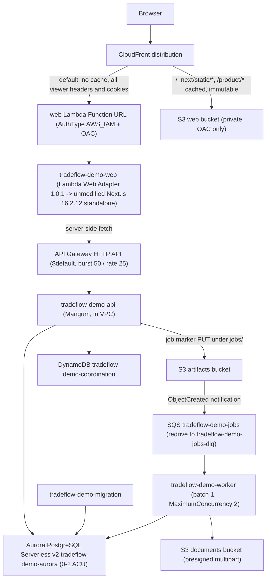

# Serverless demo runbook

Operating guide for the serverless form of the public demo in `ap-southeast-2`
(account `527673188999`). The existing EC2 host (`i-0dbb59b359b95f12c`, Elastic
IP `52.64.5.66`) keeps serving until cutover is approved; see
`docs/runbooks/serverless-cutover.md` for the migration itself. The serverless
stack has not been provisioned yet, so the commands below have not been run
against a live environment.

Everything is CloudFormation plus the AWS CLI: four templates under
`infra/cloudformation/`. `infra/scripts/deploy-serverless.sh` deploys the
network, data, and app stacks with `aws cloudformation deploy`; the ci stack is
a one-time bootstrap. No additional CLI tooling is required.

## Architecture



Request path: the browser reaches CloudFront; the default origin is the web
Lambda Function URL (CloudFront Origin Access Control, caching disabled) and the
web Lambda renders Next.js and calls the API Gateway HTTP API server-side. Only
the web Lambda is outside a VPC. The API, worker, and migration Lambdas run in
the VPC and reach S3 and DynamoDB through free gateway endpoints, which is why
there is no NAT gateway and no interface endpoint.

## Deployed resource inventory

All names are prefixed with the `ProjectName` parameter, default `tradeflow-demo`.

### Stack `tradeflow-demo-network` (`network.yaml`)

| Resource | Name | Notes |
| --- | --- | --- |
| VPC | `10.42.0.0/16` | Two private subnets only |
| Private subnets | `tradeflow-demo-private-a`, `-private-b` | `10.42.1.0/24`, `10.42.2.0/24`; no NAT gateway, no internet gateway |
| Gateway endpoints | S3, DynamoDB | Free |
| Security groups | `tradeflow-demo-lambda`, `tradeflow-demo-database` | 5432 from the Lambda group only |

### Stack `tradeflow-demo-data` (`data.yaml`)

| Resource | Name | Notes |
| --- | --- | --- |
| Aurora cluster | `tradeflow-demo-aurora` | Engine 17.9, `db.serverless`, min 0 ACU, max 2 ACU, `SecondsUntilAutoPause` 300, `EnableHttpEndpoint: false`, deletion protection on |
| S3 web bucket | `tradeflow-demo-web-<account>-ap-southeast-2` | Private, readable only through CloudFront OAC |
| S3 documents bucket | `tradeflow-demo-documents-<account>-ap-southeast-2` | Evidence uploads, presigned multipart, CORS, incomplete uploads aborted after 7 days |
| S3 artifacts bucket | `tradeflow-demo-artifacts-<account>-ap-southeast-2` | Job markers under `jobs/`, expire after 14 days, no public access |
| DynamoDB table | `tradeflow-demo-coordination` | On-demand, PK `pk`, SK `sk`, TTL attribute `ttl` |
| SQS queue | `tradeflow-demo-jobs` | Visibility timeout 960 s, redrive to `tradeflow-demo-jobs-dlq` after 5 receives; queue policy lets the artifacts bucket publish |
| SQS dead-letter queue | `tradeflow-demo-jobs-dlq` | Holds poison messages; both queues retain messages for 14 days |

### Stack `tradeflow-demo-app` (`app.yaml`)

| Resource | Name | Notes |
| --- | --- | --- |
| API Lambda | `tradeflow-demo-api` | Container image, in VPC, 1024 MB, 60 s, reserved concurrency 10 |
| Worker Lambda | `tradeflow-demo-worker` | In VPC, 1024 MB, 900 s, SQS event source, batch size 1, `MaximumConcurrency: 2`, `ReportBatchItemFailures` |
| Migration Lambda | `tradeflow-demo-migration` | Same API image, handler `tradeflow_api.migration_handler.handler`, 900 s, in VPC |
| Web Lambda | `tradeflow-demo-web` | Container image with AWS Lambda Web Adapter 1.0.1 running the unmodified Next.js 16.2.12 standalone server, not in a VPC, 1024 MB, 30 s |
| HTTP API | API Gateway `$default` route | Throttling burst 50 / rate 25 |
| Distribution | CloudFront | S3 origin for `/_next/static/*` and `/product/*`; web Function URL default origin |

CloudWatch log groups `/aws/lambda/tradeflow-demo-{api,worker,migration,web}`
have 7-day retention.

### Stack `tradeflow-demo-ci` (`ci.yaml`)

`tradeflow-demo-deploy`, a GitHub OIDC deploy role assumable only by
`repo:Kagerrak/tradeflow-erp:ref:refs/heads/main` through the pre-existing
`token.actions.githubusercontent.com` provider
(`arn:aws:iam::527673188999:oidc-provider/token.actions.githubusercontent.com`).
Permissions are scoped to CloudFormation, Lambda, ECR, SSM, IAM roles named
`tradeflow-demo-*`, networking, storage, RDS/DynamoDB/SQS, CloudFront/API
Gateway, and CloudWatch Logs. No long-lived AWS keys are stored in GitHub.

## Job flow: outbox to SQS

1. The API Lambda commits business state and its `outbox_events` row in one
   PostgreSQL transaction.
2. After a successful mutating `/v1/` request — and on a bounded,
   activity-gated recovery pass at most every 300 s — it writes a small JSON
   marker object to `s3://<artifacts>/jobs/<kind>/<id>.json` using the free S3
   gateway endpoint.
3. The artifacts bucket notification publishes that object event to
   `tradeflow-demo-jobs`, which triggers the worker Lambda. There is no polling
   loop; the queue is reachable from the VPC only because the S3 gateway
   endpoint carries the marker write out.
4. The worker runs with batch size 1 and at most 2 concurrent executions.
   There is one job per (outbox event, handler group); groups are `delivery`
   (finance/documents) and `notifications`.
5. Handlers record `outbox_handler_receipts` rows, so redelivery is a no-op.
6. Markers are keyed by event id and group, so re-publishing is an idempotent S3
   overwrite that always re-fires the notification.
7. A message that fails is received up to 5 times and then lands in
   `tradeflow-demo-jobs-dlq`.

The Redis/ARQ worker was deleted.
`apps/worker/src/tradeflow_worker/local_worker.py` is the local-development
equivalent, and `drain_pending_outbox` is used by tests.

## Demo reset lifecycle

There is no timer. Coordination lives in DynamoDB at `pk=demo, sk=state` and
`pk=demo, sk=lock`.

1. The API Lambda middleware reads the coordination record — never PostgreSQL —
   on every `/v1/` request.
2. When `next_reset_at` has passed it marks the state `refreshing` and publishes
   a `demo_reset` job.
3. The worker takes a single-flight DynamoDB lock with a 15-minute expiry
   (recovered automatically if the worker dies) plus a PostgreSQL advisory lock.
4. It truncates, then re-seeds by driving the real API in-process over loopback.
   The seeder `scripts/seed_demo.py` is reused unchanged.
5. It validates the seed contract, then marks the state `ready` with
   `next_reset_at = now + 45 minutes`.
6. While the state is not ready the API returns 503 `demo_refreshing` (or
   `demo_refresh_failed`) for `/v1/`, so nobody can read partially reset data.
7. The console shows a "Preparing the demo" overlay
   (`apps/web/components/demo-preparation-gate.tsx`) that distinguishes
   preparation, readiness, and genuine failure.

Because a reset can follow a long idle gap, the web tier mints a short-lived
HS256 demo token on demand from the shared demo signing secret
(`apps/web/lib/demo-credential.ts`) instead of reading a rotating file; a stored
two-hour token would expire while the cluster is paused. The web Lambda needs no
AWS permissions and no AWS SDK.

## Deploy

Normal path: push to `main`, which runs `.github/workflows/deploy.yml`. The
workflow builds three container images from `apps/*/Dockerfile.lambda` into the
existing ECR repositories (`tradeflow-demo-api`, `-worker`, `-web`), syncs
`.next/static` and `public/` from the built web image to the private S3 bucket,
runs the deploy script, then smoke-tests the CloudFront URL. The old EC2
pipeline is preserved manual-only as `.github/workflows/deploy-ec2-legacy.yml`.

Manual deployment:

```bash
AWS_REGION=ap-southeast-2 IMAGE_TAG=<git-sha> ./infra/scripts/deploy-serverless.sh
```

The script deploys the `network`, `data`, and `app` stacks. The `ci` stack is a
one-time bootstrap deployed directly, because the deploy role must exist before
GitHub Actions can run the script:

```bash
aws cloudformation deploy --region ap-southeast-2 \
  --stack-name tradeflow-demo-ci \
  --template-file infra/cloudformation/ci.yaml \
  --capabilities CAPABILITY_NAMED_IAM \
  --parameter-overrides \
    OidcProviderArn=arn:aws:iam::527673188999:oidc-provider/token.actions.githubusercontent.com
```

The script runs eight separate steps so a failure is unambiguous: ensure the
SSM parameters exist (create-only), deploy `network`, deploy `data`, deploy
`app`, apply runtime secrets to the Lambda environment, run migrations by
invoking `tradeflow-demo-migration` with `{"action":"upgrade","revision":"head"}`,
queue an initial demo rebuild when the coordination state is empty, and verify
the public endpoints. `SKIP_MIGRATIONS=1` skips step six; `SEED_DEMO=0` skips
step seven.

## Verify

Stack health:

```bash
aws cloudformation describe-stacks --region ap-southeast-2 \
  --stack-name tradeflow-demo-app \
  --query 'Stacks[0].StackStatus' --output text
```

Public URL and demo state:

```bash
curl -fsS "<distribution-domain>/api/demo/status"        # {"status":"ready", ...}
curl -fsS "<api-url>/health/live"
```

Prove the cluster reaches 0 ACU (this is the whole point of the auto-pause
configuration):

```bash
aws cloudwatch get-metric-statistics --region ap-southeast-2 \
  --namespace AWS/RDS --metric-name ServerlessDatabaseCapacity \
  --dimensions Name=DBClusterIdentifier,Value=tradeflow-demo-aurora \
  --start-time <iso8601-utc> --end-time <iso8601-utc> \
  --period 300 --statistics Average
```

Expect `Average` 0.0 while the demo is idle and a non-zero value for roughly
five minutes after activity, after which `SecondsUntilAutoPause` (300 s) pauses
the cluster again.

Coordination items:

```bash
aws dynamodb get-item --region ap-southeast-2 \
  --table-name tradeflow-demo-coordination \
  --key '{"pk":{"S":"demo"},"sk":{"S":"state"}}'
aws dynamodb get-item --region ap-southeast-2 \
  --table-name tradeflow-demo-coordination \
  --key '{"pk":{"S":"demo"},"sk":{"S":"lock"}}'   # absent when unlocked
```

`state` should read `status=ready` with a `next_reset_at`; `refreshing` is
normal while a rebuild runs, and `failed` should be treated as an incident.

Logs (7-day retention bounds both volume and cost):

```bash
aws logs tail /aws/lambda/tradeflow-demo-api --region ap-southeast-2 --follow
aws logs tail /aws/lambda/tradeflow-demo-worker --region ap-southeast-2 --since 1h
aws logs tail /aws/lambda/tradeflow-demo-web --region ap-southeast-2 --since 1h
```

Queue depth, then redrive the DLQ:

```bash
QUEUE_URL=$(aws cloudformation describe-stacks --region ap-southeast-2 \
  --stack-name tradeflow-demo-data \
  --query "Stacks[0].Outputs[?OutputKey=='JobsQueueUrl'].OutputValue" --output text)
aws sqs get-queue-attributes --region ap-southeast-2 --queue-url "$QUEUE_URL" \
  --attribute-names ApproximateNumberOfMessages ApproximateNumberOfMessagesNotVisible

DLQ_URL=$(aws cloudformation describe-stacks --region ap-southeast-2 \
  --stack-name tradeflow-demo-data \
  --query "Stacks[0].Outputs[?OutputKey=='JobsDeadLetterQueueUrl'].OutputValue" --output text)
DLQ_ARN=$(aws sqs get-queue-attributes --region ap-southeast-2 --queue-url "$DLQ_URL" \
  --attribute-names QueueArn --query 'Attributes.QueueArn' --output text)
QUEUE_ARN=$(aws sqs get-queue-attributes --region ap-southeast-2 --queue-url "$QUEUE_URL" \
  --attribute-names QueueArn --query 'Attributes.QueueArn' --output text)

aws sqs start-message-move-task --region ap-southeast-2 \
  --source-arn "$DLQ_ARN" --destination-arn "$QUEUE_ARN"
aws sqs list-message-move-tasks --region ap-southeast-2 --source-arn "$DLQ_ARN"
```

Redrive is safe because handlers are idempotent: a message that already has an
`outbox_handler_receipts` row is a no-op. A message that keeps failing will
return to the DLQ after another 5 receives.

## Operating limits

| Limit | Value | Consequence |
| --- | --- | --- |
| API Gateway integration timeout | 30 s | The first request against a fully paused cluster can return 504 and succeed on the bounded retry (`packages/api-client/src/retry.ts`: 20 s per attempt, 3 attempts, only GET/HEAD/OPTIONS or requests carrying an `Idempotency-Key`). |
| Aurora resume time | about 15 s; 30 s or more if paused over 24 hours | AWS recommends client connect timeouts above 15 s and retry logic. Base 504s on this, not on application errors. |
| Auto-pause | minimum `SecondsUntilAutoPause` 300 s, maximum 86,400 s | Any open user-initiated connection prevents pause regardless of whether it is running SQL. The API uses SQLAlchemy `NullPool` in Lambda so no idle connection keeps the cluster awake; RDS Proxy is deliberately not used because it holds a connection open. |
| API Lambda | 60 s, 1024 MB, reserved concurrency 10 | A slow query consumes a concurrency slot for up to a minute. |
| Worker Lambda | 900 s, 1024 MB, concurrency 2 | Lambda's maximum timeout. The SQS visibility timeout (960 s) exceeds it so a long rebuild is never redelivered while it is running. A rebuild that exceeds 900 s fails and, after 5 receives, lands in the DLQ. |
| HTTP API throttling | burst 50 / rate 25 | Deliberate ceiling for a demo; a burst above it returns 429. |
| VPC placement | API, worker, migration in the two private subnets; no NAT, no internet gateway | Those functions have no internet egress. Approved egress is the VPC plus the free S3 and DynamoDB gateway endpoints, which is why interface endpoints (about $9.49/month per AZ) and a NAT gateway (about $43/month) are not needed. |
| Database availability | One `db.serverless` instance | The Aurora writer is a single-AZ deployment with no reader and no failover target; an AZ event takes the demo database offline. |
| Log retention | 7 days | Bounds CloudWatch Logs storage cost; older logs are gone. |
| Credentials | Short-lived HS256 token minted on demand | The web Lambda holds no AWS credentials and needs no AWS SDK. |

## Rotate demo secrets

Parameters live under `/tradeflow/demo/*`: `database-password`, `reset-token`,
`auth-test-secret`, and `auth-issuer`. The three secrets are SSM SecureStrings;
no secret is stored in a template, in the stack, or in a log. The Aurora master
password is read by CloudFormation through an `ssm-secure` dynamic reference.
The deploy script creates missing parameters (`ensure_secret`) but never
overwrites existing ones, so rotation is an explicit overwrite followed by a
redeploy that re-applies the Lambda environment.

```bash
aws ssm put-parameter --region ap-southeast-2 --name /tradeflow/demo/reset-token \
  --type SecureString --overwrite --value "$(openssl rand -hex 32)"
aws ssm put-parameter --region ap-southeast-2 --name /tradeflow/demo/auth-test-secret \
  --type SecureString --overwrite --value "$(openssl rand -hex 32)"

AWS_REGION=ap-southeast-2 IMAGE_TAG=<current-sha> SKIP_MIGRATIONS=1 \
  ./infra/scripts/deploy-serverless.sh
```

The redeploy is required: values are merged into each function's environment
through `aws lambda update-function-configuration --environment file://...`, so
the secret never reaches the process list.

- `reset-token`: rotate freely. It is a demo-only control credential.
- `auth-test-secret`: rotating invalidates tokens already minted by the web
  tier; in-flight browser sessions must reload.
- `auth-issuer`: change only with a matching application configuration change.
- `database-password`: the parameter is consumed by CloudFormation at stack
  create/update, so overwriting the parameter alone does not change the live
  Aurora master credential. The reviewed procedure for rotating the live
  database credential is **unverified** — it has not been exercised, and it
  needs approval under the cutover checklist. Do not improvise it on the demo.

## Unverified

- No serverless stack has been provisioned, so none of the verification
  commands above have been executed against live resources.
- Aurora pause/resume behaviour (0 ACU reached, 15 s resume, the 504-then-retry
  path) is derived from the configuration and AWS documentation, not measured
  here.
- Whether a full demo rebuild fits inside the 900 s worker timeout has not been
  measured.
- The live `database-password` rotation procedure is not defined (see above).
